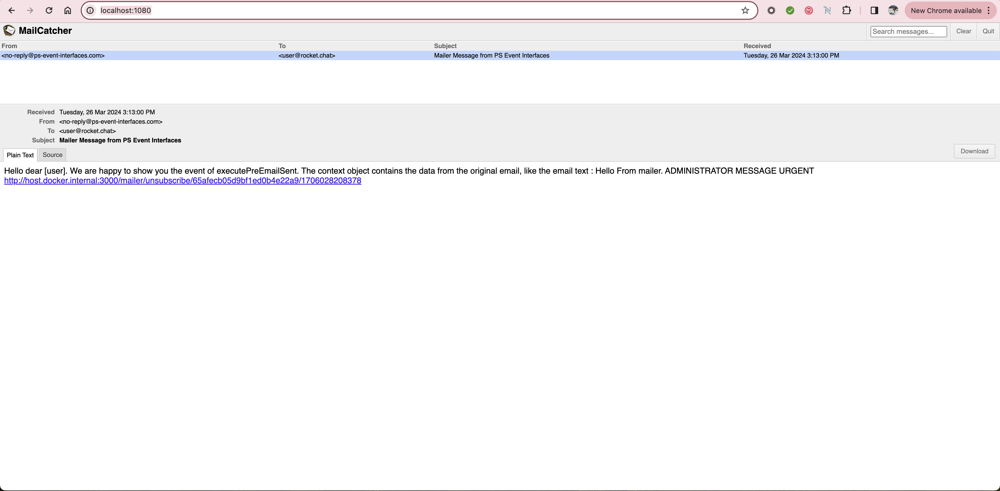

# Professional Services Event Interface Examples in Apps Engine

## ps-event-interfaces-listeners

This project contains unit samples for the event interfaces supported in Rocket.Chat [Apps Engine](https://developer.rocket.chat/apps-engine/rocket.chat-apps-engine). 


When an event occurs, there are pre-handlers and post-handlers.

* The set of **pre-handlers** are executed before the event is completed.
* The set of **post-handlers** are executed when the event is completed. 

Rocket.Chat recommends using pre-handlers to modify, extend, or change the data used for the event. If you want to listen for an event and _not modify anything_, use the post-handlers.

The handlers can operate in different ways :

* **Prevent**: Determines whether the event should be prevented or not.
* **Extend**: Allows extending the data without being destructive of the data (adding an attachment to a message, for example).
* **Modify**: Allows for destructive changes to the data (change any data).
* **IPreEvent**: Handlers that are called before an event happens.
* **IPostEvent**: Handlers that are called after an event happens.

To use events, our events app must implement the event interfaces and this is done by using the keyword implements and the name of the events, comma separated.

This project is based on explanatory examples for all existing event interfaces that can be accessed via Apps Engine. Each example has a corresponding video with the event-listener in action from a developer perspective.


## Getting Started

To run this set of examples, you need to have a running instance of Rocket.Chat and deploy the application to the Workspace using the following command :

- `rc-apps deploy --url http://<YOUR_RC_HOST>:3000 --username xxxx --password xxxx`

## Post Room Create 

As a first simple example, our app will implement the post-room creation interface with the PostRoomCreate method. This tells Apps-Engine that the app wants to connect to that event. Whenever a room is created, Apps-Engine executes this method in the app.

Each interface contains one important method to execute the defined actions: This is the event handler. There is another method ("check") that we will skip on our examples as it will soon be deprecated.

Our first example will write on the log a message every time a new room/channel is created.

```
import {
    IAppAccessors, IHttp,
    ILogger, IModify, IPersistence, IRead,
} from '@rocket.chat/apps-engine/definition/accessors';
import { App } from '@rocket.chat/apps-engine/definition/App';
import { IAppInfo } from '@rocket.chat/apps-engine/definition/metadata';
import {IPostRoomCreate, IRoom} from '@rocket.chat/apps-engine/definition/rooms';

export class PsEventInterfacesListenersApp extends App implements IPostRoomCreate {
    constructor(info: IAppInfo, logger: ILogger, accessors: IAppAccessors) {
        super(info, logger, accessors);
        console.debug('PsEventInterfacesListenersApp - Constructor');
    }

    public executePostRoomCreate(room: IRoom, read: IRead, http: IHttp, persistence: IPersistence, modify: IModify): Promise<void> {
        console.debug(' ************************************************* ');
        console.debug(' * EVENT-INTERFACES-EXAMPLE - POST ROOM CREATION * ');
        console.debug(' *************************************************  ');
        return Promise.resolve(undefined);
    }
}
```

**POST ROOM CREATE TABLE**

| Runs When  | Interface | Execute Method Name |
|:-----------|:------------:|------------:|
| A new room is created       |    IPostRoomCreate      |        executePostRoomCreate |

In this example, we are constructing a log output as per the method below.

    public executePostRoomCreate(room: IRoom, read: IRead, http: IHttp, persistence: IPersistence, modify: IModify): Promise<void> {
        console.debug(' ************************************************* ');
        console.debug(' * EVENT-INTERFACES-EXAMPLE - POST ROOM CREATION * ');
        console.debug(' *************************************************  ');
        return Promise.resolve(undefined);
    }

As you can see in the next video, every time a new room/channel is created, we can see the output from our method executePostRoomCreate.

 


Furthermore, we can expand our example and send a message to the new room as our app bot. Instead of just writing to the log file, we will now interact with the object of the event, in this case, the room.

```
 public executePostRoomCreate(room: IRoom, read: IRead, http: IHttp, persistence: IPersistence, modify: IModify): Promise<void> {
        console.debug(' ************************************************* ');
        console.debug(' * EVENT-INTERFACES-EXAMPLE - POST ROOM CREATION * ');
        console.debug(' *************************************************  ');
        read.getUserReader().getAppUser().then((user: IUser | undefined) => {
            if (user) {
                sendMessage(modify, room, user, 'Welcome to your new Room. This message comes from EVENT-INTERFACES-EXAMPLE ');
            } else {
                console.debug(' APP USER IS UNDEFINED  ');
            }
        }).catch((error) => {
            // Handle any errors that might occur during the promise resolution
        });
        return Promise.resolve(undefined);
    }
```


## Pre Email Sent

This example Our app will implement the pre-email-sent interface with the executePreEmailSent method.  Whenever an email is sent from the Rocket.Chat mailer,  Apps-Engine executes this method in the app.


**PRE EMAIL SENT TABLE**


| Runs When  | Interface | Execute Method Name |
|:-----------|:------------:|------------:|
| Before the mailer sends an email       |    IPreEmailSent      |        executePreEmailSent |

In this case, our method is building an email object that includes the text of the mailer email in its body.

To simulate an SMTP server we are using the following project : 

*  [fake-smpt-server.](https://github.com/haravich/fake-smtp-server?tab=readme-ov-file)

This project offers a quick way to set up a fake SMTP server using a Docker image, allowing you to mimic email exchanges for testing purposes. It offers a web interface where we can see the intercepted emails.



The method in our app builds an IEmailDescriptor object.  

```
public executePreEmailSent(context: IPreEmailSentContext, read: IRead, http: IHttp, persis: IPersistence, modify: IModify): Promise<IEmailDescriptor> {
        console.debug(' ************************************************* ');
        console.debug(' * EVENT-INTERFACES-EXAMPLE - PRE EMAIL SENT     * ');
        console.debug(' *************************************************  ');
        // Dummy IEmailDescriptor to satisfy the return type requirement.
        const dummyEmailDescriptor: IEmailDescriptor = {
            to: ['user@rocket.chat'],
            from: 'no-reply@ps-event-interfaces.com',
            subject: 'Mailer Message from PS Event Interfaces ',
            text : 'Hello dear [user] \n' +
                ' We are happy to show you the event of executePreEmailSent.\n\n' +
                ' The context object contains the data from the original email, like the email text : \n\n ' + context.email.text,
        };
        return Promise.resolve(dummyEmailDescriptor);
    }
```

Notice that the app is using the context of the original email to include in its Email Body.

`
context.email.text
`

To test this event, we can ask Rocket.Chat to send an email using the Mailer function in the Administration console.


